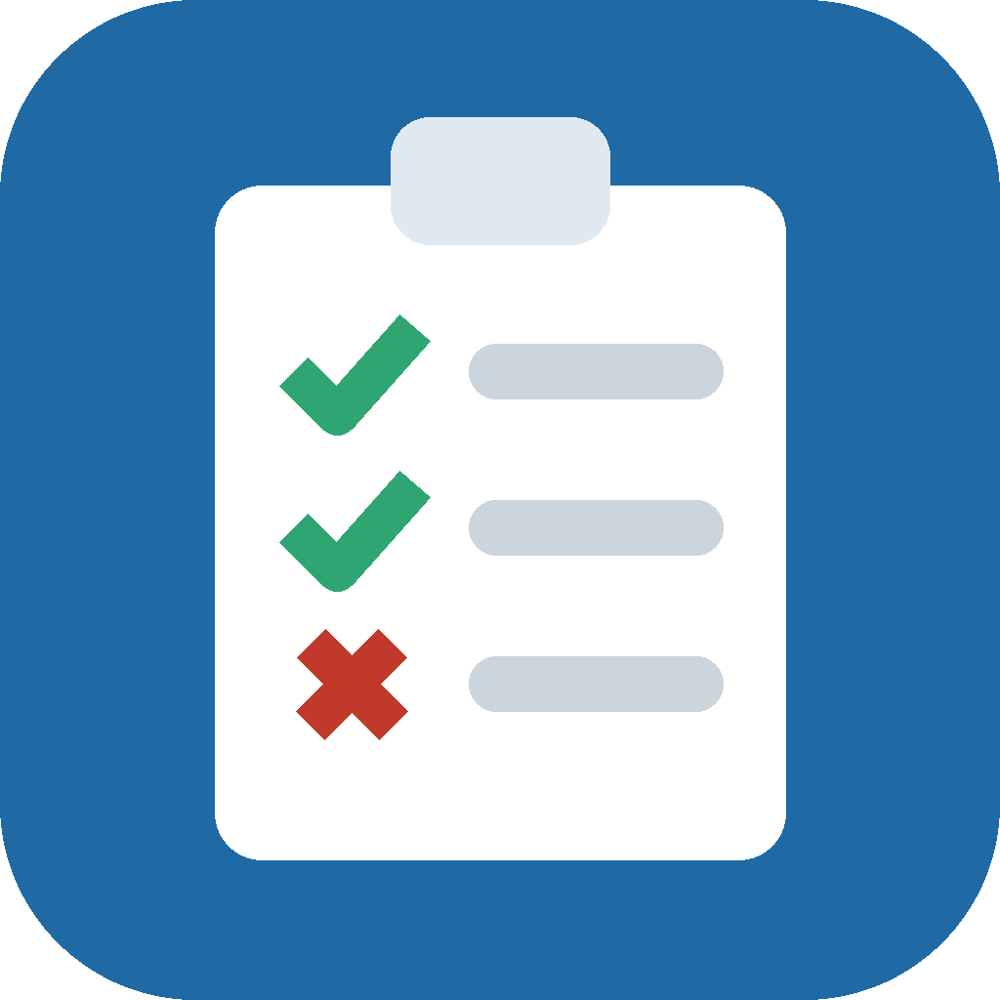

# Attendance List

A simple daily attendance tracker for Windows. Record who came, who didn't, and
why — then export it to Excel.



## Download

Get the latest **AttendanceList.exe** from the
[Releases page](https://github.com/krispx2811/attendance-list/releases/latest).

No installation. Save it anywhere and double-click it.

> **First launch:** Windows shows *"Windows protected your PC"* because the app
> is not code-signed (a signing certificate costs several hundred dollars a
> year). Click **More info → Run anyway**. You only do this once.

## Updating

The app checks GitHub for new versions when it starts. When one exists a blue
banner appears — click **Update now** and it downloads, replaces itself and
reopens. Your data is untouched.

You can also check any time from **Reports → Check for updates**.

## Using it

### Today
The screen you use each morning.

- Everyone on the roster is listed. Tap **Present**, **Late** or **Absent**.
- The **reason** box switches on only for Late and Absent, and remembers
  reasons you have used before so you can pick them from the dropdown.
- **Mark everyone present** sets the whole list at once — then just correct
  the few exceptions. This is the fastest way to do a day.
- **+ Add walk-in** records someone who is not on the roster.
- The arrows next to the date let you fill in a day you missed.

Everything saves the moment you click. There is no Save button.

### Roster
Add, rename and remove people.

- **Remove / restore** hides someone from the daily list but keeps all their
  history — use this when somebody leaves.
- **Delete permanently** erases the person *and* their records. It asks first.
- **Make permanent** turns a walk-in into a regular roster member.

### History
Search past records by name, date range or status, then export.

- **Export to Excel** produces a colour-coded `.xlsx` (green present, amber
  late, red absent) with filters already switched on.
- **Export to CSV** for anything else.
- Double-click any row to see that person's complete history and their
  attendance rate.

### Reports
Attendance rate per person, the most common reasons for absence, and:

- **Export full report** — one workbook with three sheets: Records, Summary
  and Reasons.
- **Back up now** and **Save a copy of the data** for keeping a copy elsewhere.
- **Open data folder** shows where everything is stored.

## Where your data is kept

In a `data` folder right next to the app, so everything lives in one place you
can see and copy:

```
AttendanceList.exe
data\
    attendance.db      all attendance records
    backups\           automatic daily backups (last 14 kept)
```

Updating the app replaces `AttendanceList.exe` only — the `data` folder is
never touched. Data never leaves the computer; the app contacts GitHub solely
to check for a new version.

**To move everything to another computer**, copy the whole folder.

> If you put the app somewhere Windows will not let it write — `C:\Program
> Files`, or a locked-down network share — it falls back to
> `C:\Users\<you>\AppData\Local\AttendanceList\` automatically rather than
> failing. Keeping the `.exe` somewhere like your Desktop or Documents avoids
> this entirely.

**To share one list across several PCs**, set the environment variable
`ATTENDANCE_DATA_DIR` to a shared network folder on each machine. (Best with
one person editing at a time — SQLite over a network share does not handle
simultaneous writers well.)

---

## Development

Requires Python 3.11+.

```bash
python -m venv .venv
.venv/bin/pip install -r requirements.txt
.venv/bin/python main.py
```

**On a Mac**, double-click `run-on-mac.command` instead — it sets up the
virtual environment on first run, then opens the app. It is the same
application as the Windows build; only the packaging differs.

Run the tests:

```bash
.venv/bin/python -m unittest discover -s tests -v
```

To use a throwaway database while developing:

```bash
ATTENDANCE_DATA_DIR=/tmp/attendance-dev .venv/bin/python main.py
```

### Layout

| Path | What it does |
|---|---|
| `main.py` | Entry point and startup error handling |
| `app/db.py` | SQLite schema and every query |
| `app/exporter.py` | CSV and Excel output |
| `app/updater.py` | GitHub release check and self-replacement |
| `app/paths.py` | Where the database and backups live |
| `app/ui/` | The four tabs plus shared widgets |
| `tests/test_core.py` | Storage and export tests (no GUI needed) |

### Releasing a new version

The `.exe` is built by GitHub Actions on a Windows runner — PyInstaller cannot
cross-compile, so it cannot be built from macOS or Linux.

1. Bump `__version__` in `app/version.py`.
2. Commit.
3. Tag and push:

```bash
git tag v1.0.1
git push origin main --tags
```

Actions runs the tests, builds the `.exe`, smoke-tests it, and publishes a
Release with the file attached. Everyone running an older build is offered the
update the next time they open the app.

Use **Actions → Build Windows executable → Run workflow** to build without
publishing a release; the `.exe` appears as a downloadable artifact.
